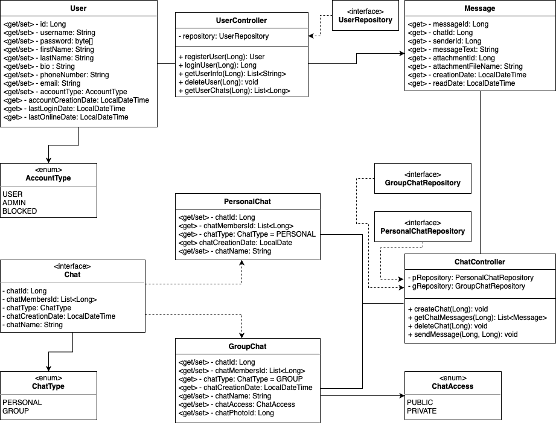

# Edu-Netcracker_Messenger
Netcracker EDU Summer 2021 - Индивидуальный учебный проект

### Запуск проекта

`mvn install`

`mvn spring-boot:run`

---
### UML - схема

### Схема базы данных

---
### API
#### User

`PUT /user/{id}` - регистрирует / изменяет данные пользователя

`POST /user/{id}` - выполняет вход от лица пользователя

`GET /user/{id}` - возвращает данные по пользователю

`DELETE /user/{id}` - удаляет пользователя

`GET /user/{id}/chats` - возвращает список id всех чатов, доступных пользователю

#### Chat

`POST /chat/create/{id}` - создает чат с пользователем

`GET /chat/{chatId}` - возвращает сообщения чата

`DELETE /chat/{chatId}` - удаляет чат

`POST /chat/{chatId}/message` - добавляет сообщение в чат
